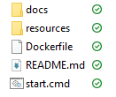

# Docker Desktop CPCT Tool 2.0

This repo contains the files needed to run the **Docker Desktop CPCT Tool** locally on your machine as a *Docker Image*.
[**Docker Desktop**](https://www.docker.com) is required to use this tool. If your organization has *Software Policies* inplace, installing
*Docker Desktop* may require a call to your company's `Help Desk` for support. Additional information can be found [here](). 

After *Docker Desktop* is installed on your system and running, you can return here to download or clone this repo to your computer, and run the `start.cmd` batch file that is located in the main directory along side the `Dockerfile`. Files in the resources directory are there to be used by the *Dockerfile* when it is building the *Dockerized Image* for **Docker Desktop**.

## Downloading the Docker Desktop CPCT Tool

To install and run the *Dockerized* **CPCT Tool** do one of the following:
- Use the [downloadable zip](https://github.com/GSA/cpct-docker/archive/refs/heads/main.zip) from this GitHub repo.
- Clone this repo using [Git](https://git-scm.com) with `git clone https://github.com/GSA/cpct-docker.git`

Then navigate to the location where you downloaded or cloned the files.

> NOTE: Make sure `Docker Desktop` is running before issuing any of the below commands.
---
## Creating and Running the Docker Desktop CPCT Tool Image:

The files you download or clone should look like the image below, if so, `Double Click` on the `start.cmd` file to start the process of building and running the *Docker Image*.
> Note: If using the `downloadable zip` file, make sure you `Right-Click` on the `zip` file you downloaded, then select `Extract All...` to extract the files to your computer before clicking on the `start.cmd` file.

<br/>




## or

Open a `commpand` window with `cmd.exe` and run the following command in the directory of the *Dockerfile* and *start.cmd*.  
```shell
Dockerfile  README.md  resources  start.cmd
 > start.cmd
```
---
## Docker Desktop:

This should `Build` and `Start` the *Docker Image*, once finished, your default `Web Browser` should open, displaying the `main` page of the **Docker Desktop CPCT Tool**. 

- View the `CPCT Main Page` by going to the local only address of: **127.0.0.1:8000**. 
> Note: The `cmd.exe` command window will close on its own. If your `default` **Web Browser** does not open, check your taskbar for already open instances of your *Web Browser*.


You can now use the **Docker Desktop CPCT Tool** to check certificates. If you have used this tool before, the functinality should be the same, the only difference is now your have the *CPCT Tool* running locally on your computer.


---
## Running the CPCT Tool

Once you have the **CPCT Tool** *Docker Image* installed and running, you **DO NOT** have to `rerun` the `start.cmd` file. This is only needed to initially `Build` and `Start` the *Docker Desktop CPCT Tool*. 

> **Note:** If you do `rerun` the `start.cmd` file again, this is not a problem. It will run the same as it did before, but will not build another `Docker Image` file. Since nothing has changed in the `Docker Image`, it will start another `instance` of the same file it download before, with the same `Image ID`, but with a different `Tag ID` number. 

**This is OK, if you feel you have too many instances running or hosted inside of Docker Desktop, feel free to stop and delete them. You can rerun the `start.cmd` to recreate and run a new image at anytime.*  

## Troubleshooting Docker Desktop:

If your admin account is different to your user account, you must add the user to the docker-users group:

```shell
net localgroup docker-users <user> /add
```
*This may require you to contact your organization's `Help Desk` for assistance. Once this requirement setting is satisfied, **Docker Desktop** should run as expected*.

---
<br><br>
-- **Docker Desktop CPCT Tool**